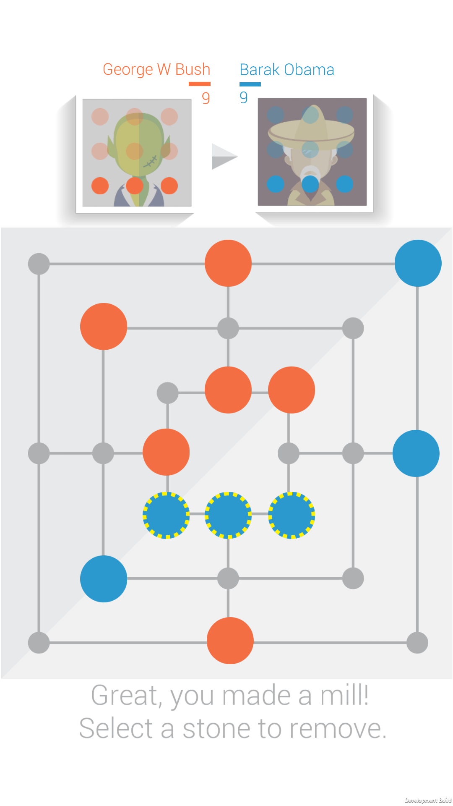

# Yet Another Morris

Yet Another Morris is a game born as a spin off of the work done for my Master's thesis, [Monte Carlo Tree Search Applied to Nine Men's Morris](https://www.politesi.polimi.it/handle/10589/126365).  

### Screenshots
From left to right: the main Menu, the board in the very first part of the game and a playing phase where the blue player makes a mill.  
      
From left to right: a playing phase where the orange player makes a mill but it is not allowed to remove the stones belonging to a mill, the board during the moving phase with highlighted the stones that can move and the board in a final configuration showing the winner.  
    

## Credits  
* [Console](https://github.com/mminer/consolation) script by _mminer_ under MIT license  
* App icons created with [Android Asset Studio](http://romannurik.github.io/AndroidAssetStudio/) by _romannurik_ under the [Creative Commons Attribution 3.0 Unported](http://creativecommons.org/licenses/by/3.0/) license  
* [Character faces icons](http://www.freepik.com/free-vector/character-faces-icons_777192.htm) designed by skydesign / [Freepik](http://www.freepik.com)  
* [Avatar background](http://www.freepik.com/free-vector/beautiful-infographics-with-icons_944870.htm) designed by pio_pio / [Freepik](http://www.freepik.com)  
* [DragHandler](https://bitbucket.org/BoredMormon/youtube-tutorials/src/a8853ef4b6168f092fcb82817a8958a7c11e5644/UI/Drag%20and%20drop/DragHandeler.cs?at=master&fileviewer=file-view-default) script by _Richard Gubb_ under no license  
* Menu based on [Game Jam Menu Template](https://www.assetstore.unity3d.com/en/#!/content/40465) by _Unity Technologies_  
